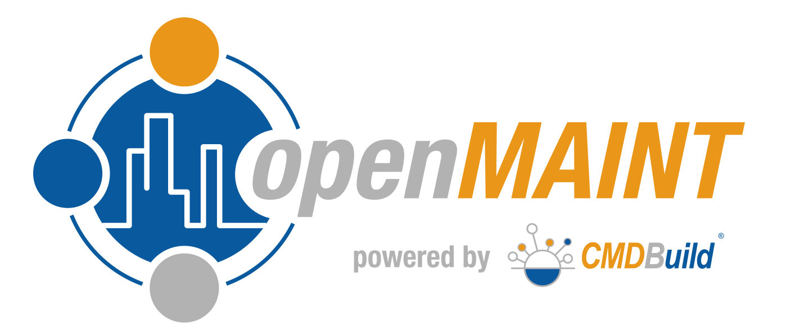

# openmaint_docker

<div align="center">
  <a href="https://www.cmdbuild.org/" target="_blank">www.cmdbuild.org>
    </a>
</div>

### What is openMAINT?

openMAINT (https://www.openmaint.org/) is a web based Property & Facility Management application that is fully open source. It is used for managing fixed and transferable physical assets such as buildings and furniture, along with related maintenance.

### What stack does this distro of openMAINT 2.0 use?

This is a fully functional openMAINT 2.0 solution using docker containers that employs the following customized stack:

- CMDBuild 3.1.1 core
- openMAINT 2.0 database dump
- Tomcat 8.5.42
- OpenJDK version 1.8.0_212
- PostgreSQL 10.7
- Debian 9.9 (stretch)

### What is CMDBuild?

CMDBuild is an open source asset management application that openMAINT is built upon. Except for some differences in the database, they are virtually identical and share the same code base.

### Doesn't openMAINT have their own build? Why use CMDBuild?

Yes, openMAINT 2.0 has its own offical build (https://sourceforge.net/projects/openmaint/files/2.0/). openmaint_docker is not an official release of openMAINT. As of 12/09/19, openMAINT's code and documentation appear to be far behind CMDBuild. It may have even depreciated in favor of builds like this one. Except for logo stylization and the database, the two are virtually identical. CMDBuild, however, has documentation that is up to date, and its code base is known to be working and well tested. openmaint_docker makes use of the latest version of CMDBuild, but has been enabled to support the openMAINT database, thereby making it a fully enabled version of openMAINT with an updated CMDBuild core code base.

### What is Docker & Docker Compose?

Docker is a popular tool that makes it easy to create, deploy, and run applications using containers. Containers allow developers to package and ship an application with a full stack of dependencies it needs to run on any other system, regardless of any conflicting configurations that may be present. Docker Compose is a companion tool for creating and running multi-container docker applications.

openmaint_docker was built and tested using the following Docker tools:

- Docker-Compose version 1.21.2, build a133471
- Docker version 19.03.5, build 633a0ea838
- Docker Pull: mrhavens/cmdbuild:app-3.1.1 (Docker Hub Repo)
- Docker Pull: mrhavens/cmdbuild:db-3.0 (Docker Hub Repo)

# Installation Instructions for Ubuntu 18.04 LTS

### Update APT Repository 
```
sudo apt update
```

### Install Docker
```
sudo apt -y install apt-transport-https ca-certificates curl software-properties-common
curl -fsSL https://download.docker.com/linux/ubuntu/gpg | sudo apt-key add -
sudo add-apt-repository "deb [arch=amd64] https://download.docker.com/linux/ubuntu bionic stable"
sudo apt update
apt-cache policy docker-ce
sudo apt -y install docker-ce
```

### Install Docker Compose
```
sudo curl -L https://github.com/docker/compose/releases/download/1.21.2/docker-compose-`uname -s`-`uname -m` -o /usr/local/bin/docker-compose
sudo chmod +x /usr/local/bin/docker-compose
```

### Build Tomcat & PostgreSQL Containers
```
git clone https://github.com/mrhavens/openmaint_docker.git
cd openmaint_docker
```

Build and bring up the database container.
```
docker-compose up -d openmaint_db
```

Wait between three to five minutes for the database to come fully online, then build and bring up the Tomcat container. If you bring the Tomcat container up too early, it will terminate, and you will have to restart it again.
```
docker-compose up -d openmaint_app
```

# Administration

openMAINT defaults to the following URL:

```
http://<openmaint_ip-address>:8080/cmdbuild
```
Where <openmaint_ip-address> is the IP address or fully qualified domain name of the server with openMAINT installed.

If your server is behind a firewall that doesn't have ports 8080 open, you can redirect all traffic through an ssh tunnel that targets your unrestricted localhost:

```
ssh -L 8080:localhost:8080 root@<openmaint_ip-address>
```

And then browse to the following URL:

```
http://localhost:8080/cmdbuild
```

### openMAINT Admin Access

Defaut admin credentials to log into openMAINT are:

```
openMAINT Admin Username: admin
openMAINT Admin Password: admin
```

### Tomcat Admin Console Access

Default admin credentials to log into Tomcat admin console are:
```
Tomcat Admin Username: admin
Tomcat Admin Password: password
```

### How do I change the Tomcat Admin Console password before deployment?
This is the prefered method. You only need to edit the password in the Tomcat configuration file provided in this distro ([openmaint/files/tomcat-users.xml](https://github.com/mrhavens/openmaint_docker/blob/master/openmaint/files/tomcat-users.xml)). This should be changed prior to deployment.

### How do I change the Tomcat Admin Console password after deployment?
Changing the Tomcat Admin Console password on a running system is somewhat more involved and requires editing the corresponding configuration file in Tomcat. Since Tomcat is inside a Docker container, this is done as follows:
 
You may need to be logged in as root on your openMAINT server in order to access Docker. On the server, you will first need to find the the Docker container ID, and assign it to a new CONTAINER_ID system variable:
```
CONTAINER_ID=`docker ps |grep cmdbuild:app-3.1.1 |cut -d" " -f1`
```

The resulting string of characters inside system variable CONTAINER_ID is the Docker container ID for Tomcat. Next, log into the container:
```
docker exec -it $CONTAINER_ID /bin/bash
```

You are now inside the Tomcat Docker container. Next, set the old password and your desired new password to the following system variable names. For example:

```
OLD_PASSWORD=password
NEW_PASSWORD=MyN3wPa$$wD!
```

Next, use sed to change the old password to the new password.

```
sed -i 's/password=\"'$OLD_PASSWORD'"/password=\"'$NEW_PASSWORD'\"/' /usr/local/tomcat/conf/tomcat-users.xml
```

Next, exit the container.
```
exit
```

You should now be back at the host server. Finally, restart the Tomcat container for the changes to take effect.
```
docker restart $CONTINER_ID
```
